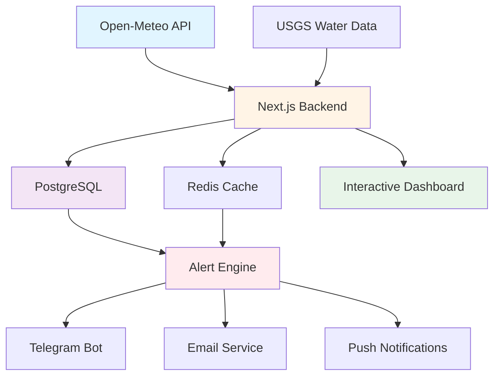

<div align="center">

# 🌊 FloodGuard
### *Your Community's Shield Against Rising Waters*


*When minutes matter, knowledge saves lives.*

[🚀 Quick Start](#-quick-start) • [📖 Documentation](#-features) • [🤝 Contributing](#-contributing) • [💬 Community](#-community)

---

</div>

##  The Challenge We're Solving

> **"Flood-prone districts need early-warning systems based on open meteorological data. How might real-time visualization and alerting help local residents prepare?"**

Every year, millions face the devastating impact of floods. The difference between safety and disaster often comes down to **one thing: time**.

###  The Reality
- **Flash floods** can occur within 6 hours of heavy rainfall
- **65% of flood deaths** happen in vehicles or while trying to escape
- **Local communities** often lack access to professional-grade warning systems
- **Critical hours** are lost when information doesn't reach those who need it most

###  Our Solution
FloodGuard transforms open meteorological data into **life-saving information** through:
-  **Real-time monitoring** of rainfall and water levels
-  **Instant alerts** via Telegram, SMS, and push notifications
-  **Visual maps** showing risk zones in your district
-  **100% free and open source** - accessible to every community

<div align="center">

```
┌─────────────────────────────────────────────────────────────┐
│   Heavy Rainfall Detected →  Data Analysis →  Alert         │
│                                                             │
│  Open-Meteo API → FloodGuard Engine → Your Community        │
│  (Free Forever)    (Smart Processing)   (Safe & Prepared)   │
└─────────────────────────────────────────────────────────────┘
```

</div>

---

##  Key Features

<table>
<tr>
<td width="50%">

###  **Live Risk Maps**
Interactive visualization showing flood risk levels across districts with color-coded zones:
- 🟢 **Safe** - Normal conditions
- 🟡 **Advisory** - Be prepared
- 🟠 **Warning** - Take action
- 🔴 **Emergency** - Immediate evacuation

</td>
<td width="50%">

###  **Multi-Channel Alerts**
Reach people where they are:
-  Telegram Bot (instant & free)
-  Email notifications
-  Browser push notifications
-  SMS (via Twilio)
-  WhatsApp integration

</td>
</tr>
<tr>
<td>

###  **Smart Predictions**
Advanced weather monitoring:
- Real-time rainfall tracking
- Historical data comparison
- Trend analysis
- Threshold-based warnings

</td>
<td>

###  **Community Power**
Crowdsourced intelligence:
- Report local conditions
- Share real-time updates
- Verify alerts
- Help neighbors prepare

</td>
</tr>
</table>

---

##  Architecture



---

##  Quick Start

### Prerequisites
```bash
Node.js 18+ • PostgreSQL 15+ • Redis 7+
```

###  One-Command Setup
```bash
# Clone the repository
git clone https://github.com/yourusername/floodguard.git
cd floodguard

# Install dependencies
npm install

# Start local development environment
docker-compose up -d

# Initialize database
npx prisma migrate dev

# Run the application
npm run dev
```

 **That's it!** Visit `http://localhost:3000` to see FloodGuard in action.

---

##  Technology Stack

<div align="center">

| Layer | Technology | Why? |
|-------|-----------|------|
| **Frontend** | Next.js 14 + TypeScript |  Fast, SEO-friendly, amazing DX |
| **Database** | PostgreSQL |  Reliable, powerful, open source |
| **Caching** | Redis |  Lightning-fast data access |
| **Maps** | Leaflet.js + OpenStreetMap |  Beautiful, free, customizable |
| **Weather** | Open-Meteo API |  Free, no API key, excellent data |
| **Alerts** | Telegram Bot API |  Free, instant, 100% reliable |
| **Styling** | Tailwind CSS |  Fast, flexible, gorgeous |
| **Charts** | Recharts |  React-native, responsive |

</div>

---

##  How It Works

### For Residents

```
1️ Subscribe via Telegram
   /subscribe Jaipur
   
2️ Get Real-Time Alerts
    FLOOD WARNING: Heavy rainfall detected in Jaipur
    Current: 75mm | Threshold: 50mm
    Recommendation: Avoid low-lying areas
   
3️ View Live Map
    See your district's risk level
    Track rainfall trends
    Read community reports
   
4️ Stay Safe
    Early warning received
    Action plan ready
    Community informed
```

### For Administrators

```typescript
// Set up alert thresholds
const THRESHOLDS = {
  ADVISORY: 20,    // 20mm rainfall
  WARNING: 50,     // 50mm rainfall  
  EMERGENCY: 100   // 100mm rainfall
};

// Monitor multiple districts
districts.forEach(district => {
  monitorWeather(district);
  checkThresholds(district);
  sendAlerts(district);
});
```

---

##  Screenshots

<div align="center">

###  Real-Time Dashboard
*Interactive map showing flood risk across districts*

###  Analytics View
*Historical data and trend analysis*

###  Mobile Experience
*PWA for on-the-go alerts*

###  Telegram Bot
*Simple subscription and instant notifications*

</div>

---

##  Roadmap

- [x] Core alert system
- [x] Telegram integration
- [x] Interactive maps
- [ ] **AI-powered predictions** using historical data
- [ ] **Multi-language support** (Hindi, Bengali, Telugu)
- [ ] **Mobile apps** (iOS & Android)
- [ ] **Government integration** with official flood data
- [ ] **Evacuation route planning**
- [ ] **Emergency shelter locator**
- [ ] **Relief coordination system**

---

##  Contributing

We believe in the power of community! Here's how you can help:

###  Found a Bug?
Open an issue with details and steps to reproduce.

###  Have an Idea?
Share your suggestions in GitHub Discussions.

###  Want to Code?
1. Fork the repository
2. Create your feature branch (`git checkout -b feature/AmazingFeature`)
3. Commit your changes (`git commit -m 'Add some AmazingFeature'`)
4. Push to the branch (`git push origin feature/AmazingFeature`)
5. Open a Pull Request

###  Improve Documentation?
Documentation updates are always welcome!

---

##  Community

<div align="center">

[](https://t.me/floodguard)
[](https://discord.gg/floodguard)
[](https://twitter.com/floodguard)

</div>

---

##  License

This project is licensed under the MIT License - see the [LICENSE](LICENSE) file for details.

**Why MIT?** We want FloodGuard to reach every community that needs it, without barriers.

---

##  Acknowledgments

- **Open-Meteo** for providing free, reliable weather data
- **OpenStreetMap** community for incredible mapping resources
- **USGS** for real-time water level data
- **Every contributor** who believes technology can save lives

---

##  Support the Project

FloodGuard is and will always be **100% free**. If this project helps your community:

-  Star this repository
-  Share on social media
-  Contribute code or documentation
-  Spread the word in your community

---

<div align="center">

### 🌊 Together, We Can Save Lives

*Built with ❤️ by developers who care*

**[Get Started Now](#-quick-start)** | **[View Demo](https://floodguard-demo.vercel.app)** | **[Read Docs](https://docs.floodguard.org)**

---

<sub>Made possible by open source. Made better by community.</sub>

</div>
